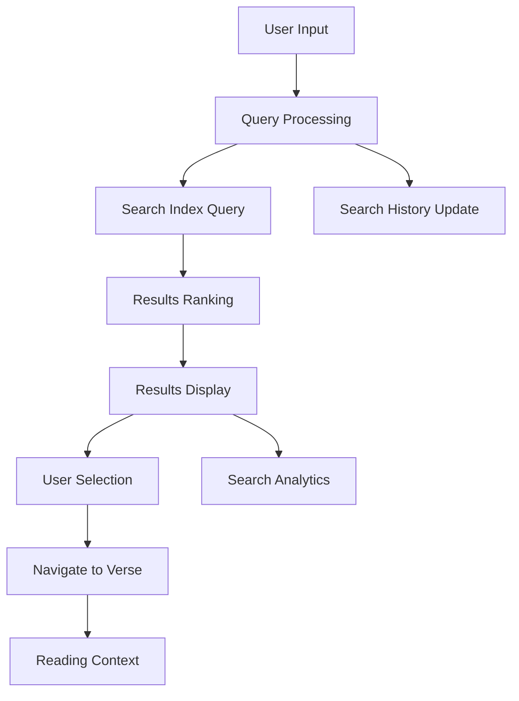

# Verse Search Feature Requirements Document

## 1. Product Overview

The Verse Search feature will enable users to quickly find specific Bible verses, passages, and content across all available translations in the OpenBible app. This feature addresses the critical need for efficient Bible study by allowing users to search by keywords, phrases, references, and topics, making the vast biblical content easily accessible and discoverable.

## 2. Core Features

### 2.1 User Roles

| Role | Registration Method | Core Permissions |
|------|---------------------|------------------|
| Authenticated User | Email registration | Full search access, save search history, create search bookmarks |
| Guest User | No registration | Basic search functionality with limited results |

### 2.2 Feature Module

Our verse search requirements consist of the following main components:

1. **Search Interface**: Global search bar, advanced search modal, search filters and options
2. **Search Results Page**: Verse results display, pagination, sorting options, export functionality
3. **Search History**: Recent searches, saved searches, search suggestions
4. **Integration Components**: Search highlights, quick search from reading view, search-to-notes linking

### 2.3 Page Details

| Page Name | Module Name | Feature Description |
|-----------|-------------|---------------------|
| Search Interface | Global Search Bar | Always-visible search input with autocomplete, voice search support, recent search suggestions |
| Search Interface | Advanced Search Modal | Detailed search filters (book, chapter, translation, date range), boolean operators, exact phrase matching |
| Search Interface | Search Filters | Translation selector, book/testament filters, content type filters (verse text, notes, bookmarks) |
| Search Results | Results Display | Verse cards with context, translation comparison, relevance scoring, snippet highlighting |
| Search Results | Pagination System | Infinite scroll or paginated results, results per page settings, jump to page functionality |
| Search Results | Export Options | Export search results to PDF, copy verses with references, share search results |
| Search History | Recent Searches | Last 20 searches with quick re-run, search frequency tracking, search date stamps |
| Search History | Saved Searches | Bookmark important searches, organize saved searches, set search alerts |
| Integration | Reading View Search | Quick search from verse context menu, search within current book/chapter, related verse suggestions |
| Integration | Search Highlights | Highlight search terms in results, maintain highlights in reading view, customizable highlight colors |

## 3. Core Process

### User Search Flow

1. **Basic Search**: User enters search term → System processes query → Results displayed with relevance ranking → User selects verse → Navigate to full context
2. **Advanced Search**: User opens advanced search → Sets filters (translation, books, date) → Enters complex query → System processes with filters → Filtered results displayed
3. **Search History**: User accesses search history → Views recent/saved searches → Selects previous search → Results re-displayed → Option to modify and re-search

### Search Processing Flow



## 4. User Interface Design

### 4.1 Design Style

- **Primary Colors**: Blue (#3B82F6) for search elements, Green (#10B981) for found results
- **Secondary Colors**: Gray (#6B7280) for filters, Yellow (#F59E0B) for highlights
- **Button Style**: Rounded corners (8px), subtle shadows, hover animations
- **Typography**: Inter for UI elements, user's selected Bible font for verse text
- **Layout Style**: Clean card-based design, generous whitespace, mobile-first responsive
- **Icons**: Lucide React icons for search, filter, and navigation elements

### 4.2 Page Design Overview

| Page Name | Module Name | UI Elements |
|-----------|-------------|-------------|
| Search Interface | Global Search Bar | Fixed header position, magnifying glass icon, placeholder text "Search verses, keywords, or references", autocomplete dropdown with recent searches |
| Search Interface | Advanced Search Modal | Modal overlay with form sections, collapsible filter groups, toggle switches for options, clear/reset buttons |
| Search Results | Results Display | Card layout with verse text, reference badge, translation indicator, context preview, action buttons (bookmark, note, share) |
| Search Results | Pagination | Bottom-aligned pagination with page numbers, previous/next arrows, results count display |
| Search History | History Panel | Sidebar or modal with chronological list, search term highlighting, quick action buttons, delete/clear options |

### 4.3 Responsiveness

Mobile-first design with touch-optimized search interface, collapsible filters for mobile, swipe gestures for result navigation, and voice search integration for mobile devices.

## 5. Technical Architecture

### 5.1 Search Capabilities

**Full-Text Search**
- Search across all Bible translations simultaneously
- Support for partial word matching and stemming
- Fuzzy search for handling typos and variations
- Multi-language search support for different Bible translations

**Reference Search**
- Parse and search by book/chapter/verse references (e.g., "John 3:16", "Romans 8:28-30")
- Support for abbreviated book names (e.g., "Jn", "Rom")
- Range searches (e.g., "Genesis 1-3", "Psalms 23-25")
- Cross-reference linking and related verse suggestions

**Advanced Search Options**
- Boolean operators (AND, OR, NOT)
- Exact phrase matching with quotation marks
- Wildcard searches with * and ? operators
- Proximity searches (words within X distance)

### 5.2 Database Architecture

**Search Index Structure**
```sql
-- Full-text search index on bible_verses
CREATE INDEX idx_bible_search_gin ON bible_verses 
USING GIN (to_tsvector('english', text));

-- Composite index for reference searches
CREATE INDEX idx_bible_reference ON bible_verses 
(book, chapter, verse, translation);

-- Search history table
CREATE TABLE search_history (
  id UUID PRIMARY KEY DEFAULT gen_random_uuid(),
  user_id UUID REFERENCES auth.users(id),
  query TEXT NOT NULL,
  filters JSONB,
  results_count INTEGER,
  created_at TIMESTAMP DEFAULT NOW()
);

-- Saved searches table
CREATE TABLE saved_searches (
  id UUID PRIMARY KEY DEFAULT gen_random_uuid(),
  user_id UUID REFERENCES auth.users(id),
  name TEXT NOT NULL,
  query TEXT NOT NULL,
  filters JSONB,
  created_at TIMESTAMP DEFAULT NOW()
);
```

### 5.3 Search API Endpoints

**Core Search API**
```typescript
// Search verses
POST /api/search/verses
{
  query: string,
  translations?: string[],
  books?: string[],
  limit?: number,
  offset?: number,
  exact?: boolean
}

// Search by reference
GET /api/search/reference?ref=John+3:16&translation=ESV

// Search suggestions
GET /api/search/suggestions?q=love

// Search history
GET /api/search/history
POST /api/search/history (save search)
DELETE /api/search/history/:id
```

### 5.4 Performance Optimization

**Indexing Strategy**
- PostgreSQL GIN indexes for full-text search
- Composite B-tree indexes for reference searches
- Materialized views for popular search aggregations
- Search result caching with Redis (if implemented)

**Search Optimization**
- Query result pagination (20-50 results per page)
- Debounced search input (300ms delay)
- Search result caching for common queries
- Lazy loading of verse context and related data

**Caching Strategy**
- Browser cache for search suggestions and recent searches
- Server-side caching for popular search results
- CDN caching for static search indexes
- Progressive loading of search results

### 5.5 Integration Features

**Search Highlighting**
- Highlight search terms in verse text using `<mark>` tags
- Maintain highlights when navigating to full verse context
- Customizable highlight colors in user preferences
- Support for multiple search term highlighting

**Cross-Feature Integration**
- Quick search from verse context menus in reading view
- Search within user's notes and bookmarks
- Link search results to existing notes and highlights
- Export search results with user annotations

**Search Analytics**
- Track popular search terms and queries
- Monitor search performance and user behavior
- Generate search insights for content recommendations
- A/B testing for search interface improvements

## 6. Implementation Phases

### Phase 1: Basic Search (MVP)
- Global search bar with basic full-text search
- Simple results display with verse text and references
- Basic pagination and result limiting
- Search history storage

### Phase 2: Advanced Search
- Advanced search modal with filters
- Boolean operators and exact phrase matching
- Translation and book filtering
- Saved searches functionality

### Phase 3: Enhanced Features
- Search suggestions and autocomplete
- Voice search integration
- Search result export and sharing
- Advanced analytics and recommendations

### Phase 4: AI-Powered Search
- Semantic search capabilities
- Topic-based search recommendations
- Natural language query processing
- Personalized search results based on reading history

## 7. Success Metrics

- **Search Usage**: Number of searches per user per session
- **Search Success Rate**: Percentage of searches resulting in verse selection
- **Search Performance**: Average search response time (<200ms target)
- **User Engagement**: Time spent on search results and subsequent reading
- **Feature Adoption**: Usage of advanced search features and saved searches