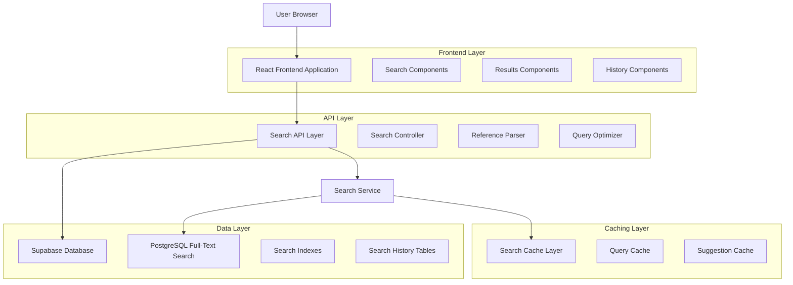
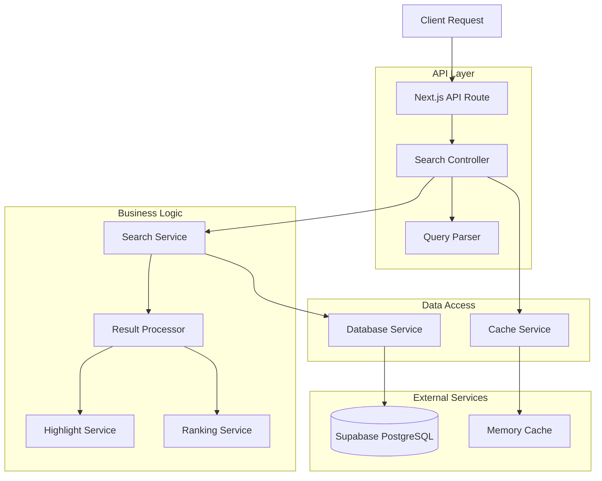
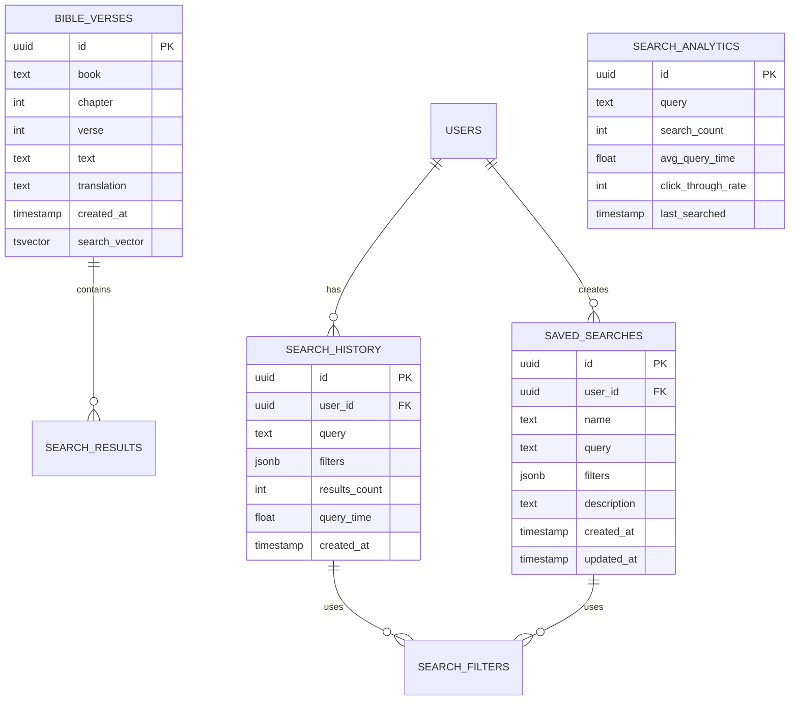

# Verse Search Technical Architecture Document

## 1. Architecture Design



## 2. Technology Description

* **Frontend**: React\@18 + TypeScript + Tailwind CSS + Vite

* **Backend**: Next.js API Routes + Supabase

* **Database**: Supabase (PostgreSQL) with Full-Text Search

* **Search Engine**: PostgreSQL GIN indexes + Custom search algorithms

* **Caching**: Browser localStorage + Supabase Edge Functions

* **State Management**: React Context + Custom hooks

## 3. Route Definitions

| Route                   | Purpose                                                  |
| ----------------------- | -------------------------------------------------------- |
| /search                 | Main search interface with global search bar and results |
| /search/advanced        | Advanced search modal with detailed filters              |
| /search/history         | User's search history and saved searches management      |
| /api/search/verses      | API endpoint for verse text search                       |
| /api/search/reference   | API endpoint for Bible reference search                  |
| /api/search/suggestions | API endpoint for search autocomplete                     |
| /api/search/history     | API endpoint for search history management               |

## 4. API Definitions

### 4.1 Core Search APIs

**Verse Search**

```
POST /api/search/verses
```

Request:

| Param Name   | Param Type | isRequired | Description                                       |
| ------------ | ---------- | ---------- | ------------------------------------------------- |
| query        | string     | true       | Search query text                                 |
| translations | string\[]  | false      | Array of translation abbreviations (default: all) |
| books        | string\[]  | false      | Array of book names to search within              |
| testament    | string     | false      | 'old', 'new', or 'both' (default: both)           |
| exact        | boolean    | false      | Exact phrase matching (default: false)            |
| limit        | number     | false      | Number of results per page (default: 20)          |
| offset       | number     | false      | Pagination offset (default: 0)                    |

Response:

| Param Name  | Param Type     | Description                           |
| ----------- | -------------- | ------------------------------------- |
| results     | VerseResult\[] | Array of matching verses              |
| total       | number         | Total number of matching verses       |
| query\_time | number         | Search execution time in milliseconds |
| suggestions | string\[]      | Alternative search suggestions        |

Example Request:

```json
{
  "query": "love one another",
  "translations": ["ESV", "NIV"],
  "testament": "new",
  "limit": 10
}
```

Example Response:

```json
{
  "results": [
    {
      "id": "uuid",
      "book": "1 John",
      "chapter": 4,
      "verse": 7,
      "text": "Beloved, let us love one another, for love is from God...",
      "translation": "ESV",
      "relevance_score": 0.95,
      "highlighted_text": "Beloved, let us <mark>love one another</mark>, for <mark>love</mark> is from God..."
    }
  ],
  "total": 156,
  "query_time": 45,
  "suggestions": ["love your neighbor", "love God"]
}
```

**Reference Search**

```
GET /api/search/reference
```

Request:

| Param Name  | Param Type | isRequired | Description                                           |
| ----------- | ---------- | ---------- | ----------------------------------------------------- |
| ref         | string     | true       | Bible reference (e.g., "John 3:16", "Romans 8:28-30") |
| translation | string     | false      | Translation abbreviation (default: user preference)   |

Response:

| Param Name        | Param Type      | Description                            |
| ----------------- | --------------- | -------------------------------------- |
| verses            | BibleVerse\[]   | Array of verses matching the reference |
| parsed\_reference | ParsedReference | Parsed reference object                |
| context           | ContextVerse\[] | Surrounding verses for context         |

**Search Suggestions**

```
GET /api/search/suggestions
```

Request:

| Param Name | Param Type | isRequired | Description                        |
| ---------- | ---------- | ---------- | ---------------------------------- |
| q          | string     | true       | Partial query for autocomplete     |
| limit      | number     | false      | Number of suggestions (default: 5) |

Response:

| Param Name  | Param Type    | Description                 |
| ----------- | ------------- | --------------------------- |
| suggestions | Suggestion\[] | Array of search suggestions |

### 4.2 Search History APIs

**Get Search History**

```
GET /api/search/history
```

Response:

| Param Name        | Param Type           | Description           |
| ----------------- | -------------------- | --------------------- |
| recent\_searches  | SearchHistoryItem\[] | Last 20 searches      |
| saved\_searches   | SavedSearch\[]       | User's saved searches |
| popular\_searches | string\[]            | Popular search terms  |

**Save Search**

```
POST /api/search/history
```

Request:

| Param Name | Param Type    | isRequired | Description            |
| ---------- | ------------- | ---------- | ---------------------- |
| query      | string        | true       | Search query           |
| filters    | SearchFilters | false      | Applied search filters |
| save\_as   | string        | false      | Name for saved search  |

## 5. Server Architecture Diagram



## 6. Data Model

### 6.1 Data Model Definition



### 6.2 Data Definition Language

**Search History Table**

```sql
-- Create search history table
CREATE TABLE search_history (
    id UUID PRIMARY KEY DEFAULT gen_random_uuid(),
    user_id UUID REFERENCES auth.users(id) ON DELETE CASCADE,
    query TEXT NOT NULL,
    filters JSONB DEFAULT '{}',
    results_count INTEGER DEFAULT 0,
    query_time FLOAT DEFAULT 0,
    created_at TIMESTAMP WITH TIME ZONE DEFAULT NOW()
);

-- Create index for user queries
CREATE INDEX idx_search_history_user_id ON search_history(user_id);
CREATE INDEX idx_search_history_created_at ON search_history(created_at DESC);
CREATE INDEX idx_search_history_query ON search_history USING GIN (to_tsvector('english', query));
```

**Saved Searches Table**

```sql
-- Create saved searches table
CREATE TABLE saved_searches (
    id UUID PRIMARY KEY DEFAULT gen_random_uuid(),
    user_id UUID REFERENCES auth.users(id) ON DELETE CASCADE,
    name TEXT NOT NULL,
    query TEXT NOT NULL,
    filters JSONB DEFAULT '{}',
    description TEXT,
    created_at TIMESTAMP WITH TIME ZONE DEFAULT NOW(),
    updated_at TIMESTAMP WITH TIME ZONE DEFAULT NOW(),
    
    UNIQUE(user_id, name)
);

-- Create indexes
CREATE INDEX idx_saved_searches_user_id ON saved_searches(user_id);
CREATE INDEX idx_saved_searches_name ON saved_searches(user_id, name);
```

**Enhanced Bible Verses Search Index**

```sql
-- Add search vector column to bible_verses
ALTER TABLE bible_verses ADD COLUMN search_vector tsvector;

-- Update search vector with text content
UPDATE bible_verses SET search_vector = to_tsvector('english', text);

-- Create GIN index for full-text search
CREATE INDEX idx_bible_verses_search_vector ON bible_verses USING GIN(search_vector);

-- Create function to automatically update search vector
CREATE OR REPLACE FUNCTION update_search_vector()
RETURNS TRIGGER AS $$
BEGIN
    NEW.search_vector = to_tsvector('english', NEW.text);
    RETURN NEW;
END;
$$ LANGUAGE plpgsql;

-- Create trigger to update search vector on insert/update
CREATE TRIGGER update_bible_verses_search_vector
    BEFORE INSERT OR UPDATE ON bible_verses
    FOR EACH ROW EXECUTE FUNCTION update_search_vector();
```

**Search Analytics Table**

```sql
-- Create search analytics table
CREATE TABLE search_analytics (
    id UUID PRIMARY KEY DEFAULT gen_random_uuid(),
    query TEXT NOT NULL,
    search_count INTEGER DEFAULT 1,
    avg_query_time FLOAT DEFAULT 0,
    click_through_rate FLOAT DEFAULT 0,
    last_searched TIMESTAMP WITH TIME ZONE DEFAULT NOW(),
    
    UNIQUE(query)
);

-- Create indexes
CREATE INDEX idx_search_analytics_query ON search_analytics(query);
CREATE INDEX idx_search_analytics_count ON search_analytics(search_count DESC);
CREATE INDEX idx_search_analytics_last_searched ON search_analytics(last_searched DESC);
```

**Row Level Security Policies**

```sql
-- Enable RLS on search tables
ALTER TABLE search_history ENABLE ROW LEVEL SECURITY;
ALTER TABLE saved_searches ENABLE ROW LEVEL SECURITY;

-- Search history policies
CREATE POLICY "Users can view their own search history" ON search_history
    FOR SELECT USING (auth.uid() = user_id);

CREATE POLICY "Users can insert their own search history" ON search_history
    FOR INSERT WITH CHECK (auth.uid() = user_id);

CREATE POLICY "Users can delete their own search history" ON search_history
    FOR DELETE USING (auth.uid() = user_id);

-- Saved searches policies
CREATE POLICY "Users can view their own saved searches" ON saved_searches
    FOR SELECT USING (auth.uid() = user_id);

CREATE POLICY "Users can insert their own saved searches" ON saved_searches
    FOR INSERT WITH CHECK (auth.uid() = user_id);

CREATE POLICY "Users can update their own saved searches" ON saved_searches
    FOR UPDATE USING (auth.uid() = user_id);

CREATE POLICY "Users can delete their own saved searches" ON saved_searches
    FOR DELETE USING (auth.uid() = user_id);

-- Search analytics is publicly readable for popular searches
CREATE POLICY "Search analytics are publicly readable" ON search_analytics
    FOR SELECT USING (true);
```

**Initial Data**

```sql
-- Insert popular search terms for suggestions
INSERT INTO search_analytics (query, search_count, avg_query_time) VALUES
('love', 1000, 25.5),
('faith', 850, 22.3),
('hope', 720, 28.1),
('peace', 680, 24.7),
('joy', 650, 26.2),
('salvation', 580, 31.4),
('grace', 560, 29.8),
('forgiveness', 520, 33.2),
('eternal life', 480, 35.6),
('kingdom of heaven', 450, 38.9);
```

## 7. Performance Considerations

### 7.1 Database Optimization

* **Full-text search indexes**: GIN indexes on `search_vector` column

* **Composite indexes**: Multi-column indexes for filtered searches

* **Query optimization**: Use EXPLAIN ANALYZE to optimize search queries

* **Connection pooling**: Supabase handles connection pooling automatically

### 7.2 Caching Strategy

* **Query result caching**: Cache popular search results for 5 minutes

* **Suggestion caching**: Cache autocomplete suggestions for 1 hour

* **User search history**: Cache in browser localStorage

* **Search analytics**: Cache popular searches for 24 hours

### 7.3 Search Performance Targets

* **Query response time**: < 200ms for typical searches

* **Autocomplete response**: < 100ms for suggestions

* **Large result sets**: Paginated with 20 results per page

* **Concurrent users**: Support 100+ concurrent searches

## 8. Security Considerations

### 8.1 Input Validation

* **SQL injection prevention**: Use parameterized queries

* **XSS prevention**: Sanitize search highlights

* **Rate limiting**: Limit search requests per user

* **Query complexity**: Limit search query length and complexity

### 8.2 Data Privacy

* **Search history**: User-specific with RLS policies

* **Anonymous searches**: Support for guest users

* **Data retention**: Configurable search history retention

* **GDPR compliance**: User data deletion capabilities

